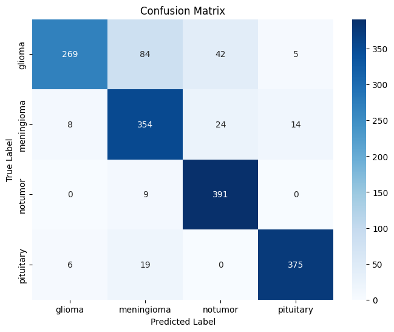
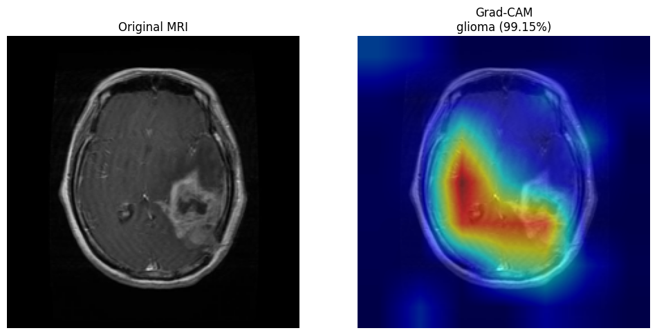
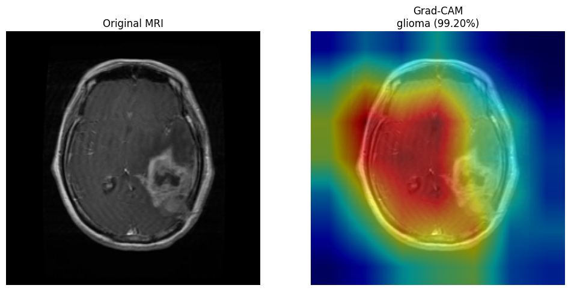
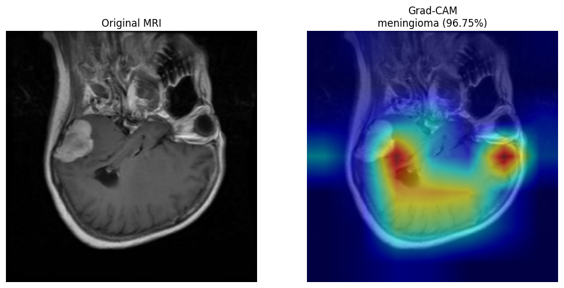
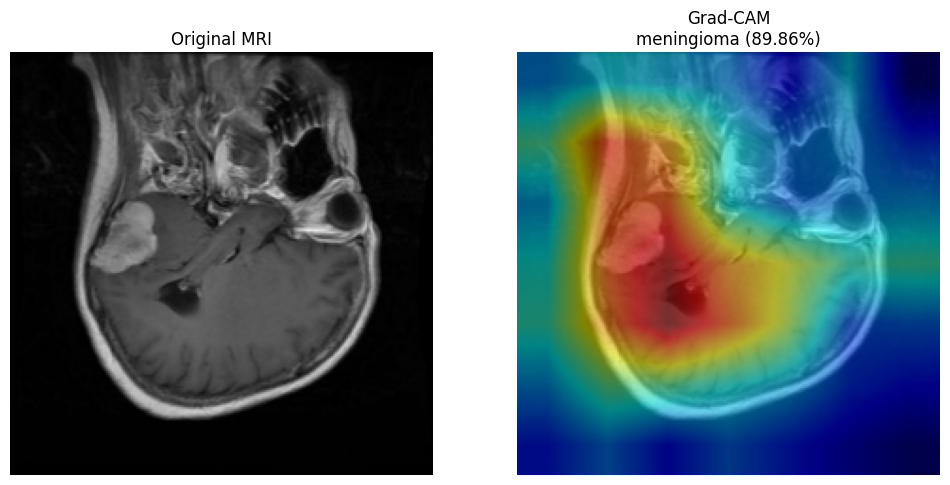
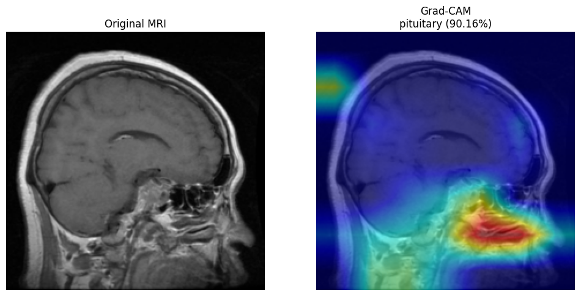
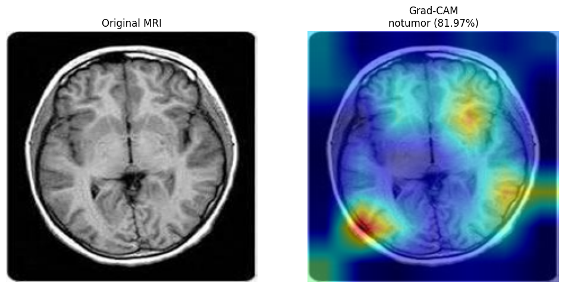
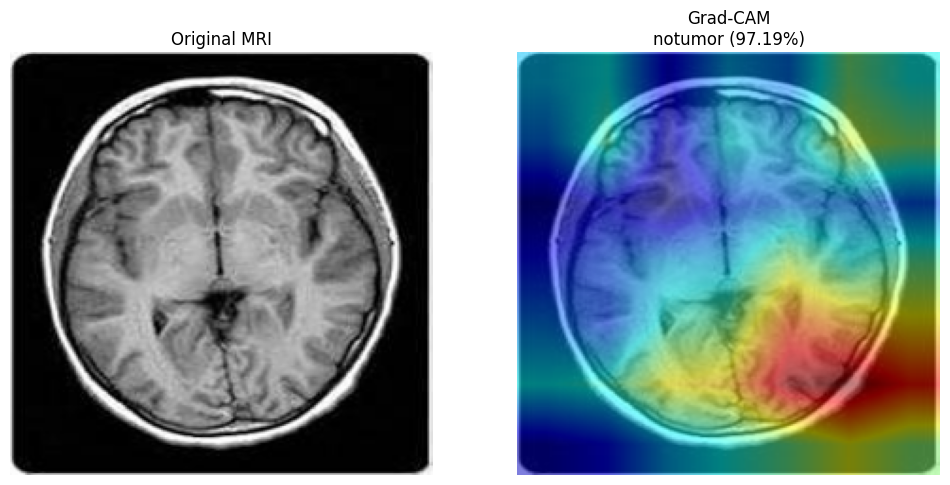

# 🧠 Brain Tumor Classification using Transfer Learning and Explainable AI

A deep learning project that classifies **brain MRI images** into four categories using **transfer learning** with three state-of-the-art CNN architectures. The project compares **ResNet50**, **DenseNet121**, and **EfficientNet-B0**, while integrating **Grad-CAM** to provide visual explanations for model predictions.

---

# 📌 Overview

Brain tumor diagnosis from MRI scans is a challenging task where accurate and timely detection can assist medical professionals in making better clinical decisions. This project leverages pretrained convolutional neural networks (CNNs) through transfer learning to classify MRI images into four categories:

- 🧠 Glioma
- 🧠 Meningioma
- 🧠 Pituitary Tumor
- ✅ No Tumor

To improve model interpretability, **Grad-CAM** was used to visualize the regions of MRI scans responsible for each prediction.

---

# ✨ Features

- Transfer Learning using pretrained CNNs
- Comparison of three architectures
- Brain MRI image classification
- Explainable AI using Grad-CAM
- Single image prediction
- Prediction confidence scores
- Confusion Matrix
- Classification Report
- Training & Validation performance tracking
- Easy inference on external MRI images

---

# 📂 Dataset

This project uses the **Brain Tumor MRI Dataset** created by **Masoud Nickparvar**, which is publicly available on Kaggle.

### Dataset Summary

- **Total Images:** 7,200
- **Classes:** 4
  - Glioma
  - Meningioma
  - Pituitary Tumor
  - No Tumor
- **Training Images:** 5,600 (1,400 per class)
- **Testing Images:** 1,600 (400 per class)
- **Image Type:** Brain MRI
- **License:** CC BY 4.0

### Dataset Structure

```text
Training/
├── glioma/
├── meningioma/
├── pituitary/
└── notumor/

Testing/
├── glioma/
├── meningioma/
├── pituitary/
└── notumor/
```

### Dataset Source

The dataset is available on Kaggle:

https://www.kaggle.com/datasets/masoudnickparvar/brain-tumor-mri-dataset

This dataset is a curated combination of publicly available brain MRI datasets, including **Figshare**, **SARTAJ**, and **Br35H**. Version 2 removes duplicate images, balances all four classes, and eliminates overlap between the training and testing sets to reduce data leakage. :contentReference[oaicite:0]{index=0}

---

### Dataset Split

- Training Images
- Testing Images

### Image Preprocessing

- RGB Images
- Resize → **224 × 224**
- Tensor Conversion
- Image Normalization

---

# 🏗️ Project Pipeline

```text
Brain MRI Images
        │
        ▼
Image Preprocessing
        │
        ▼
Transfer Learning
        │
 ┌──────────────┬──────────────┬──────────────┐
 │   ResNet50   │ DenseNet121  │ EfficientNet │
 └──────────────┴──────────────┴──────────────┘
        │
        ▼
Prediction
        │
        ▼
Model Evaluation
        │
        ▼
Grad-CAM Explainability
```

---

# 🛠️ Technologies Used

| Category | Technology |
|-----------|------------|
| Language | Python |
| Deep Learning | PyTorch |
| Computer Vision | Torchvision |
| Image Processing | OpenCV, Pillow |
| Data Handling | NumPy, Pandas |
| Visualization | Matplotlib, Seaborn |
| Evaluation | Scikit-Learn |
| Explainability | Grad-CAM |
| Development | Jupyter Notebook |

---

# 🧠 Models Used

## 🔹 ResNet50

Residual Neural Network with skip connections that enables training of very deep architectures while mitigating the vanishing gradient problem.

---

## 🔹 DenseNet121

A densely connected convolutional network where each layer receives feature maps from all preceding layers, improving feature reuse and gradient propagation.

---

## 🔹 EfficientNet-B0

A lightweight architecture that scales network depth, width, and resolution using compound scaling to achieve high performance with fewer parameters.

---

# ⚙️ Training Configuration

| Parameter | Value |
|------------|-------|
| Epochs | 15 |
| Batch Size | 32 |
| Optimizer | Adam |
| Loss Function | CrossEntropyLoss |
| Learning Rate Scheduler | ReduceLROnPlateau |
| Input Size | 224 × 224 |

---

# 📊 Training Results

| Model | Best Epoch | Training Loss | Training Accuracy | Validation Loss | Validation Accuracy |
|------|:------:|:------:|:------:|:------:|:------:|
| **ResNet50** | 13 / 15 | 0.2003 | **94.00%** | 0.7238 | 86.81% |
| **DenseNet121** | 15 / 15 | 0.2363 | 91.54% | 0.4308 | 86.75% |
| **EfficientNet-B0** | 11 / 15 | 0.2483 | 90.70% | **0.4055** | **87.75%** |

---

# 📈 Test Set Performance

| Model | Accuracy | Precision | Recall | F1 Score |
|--------|---------:|----------:|-------:|---------:|
| **ResNet50** | **88.00%** | **0.88** | **0.88** | **0.87** |
| DenseNet121 | 87.00% | 0.87 | 0.87 | 0.86 |
| EfficientNet-B0 | 87.00% | 0.88 | 0.87 | 0.87 |

---

# 📊 Detailed Classification Reports

## 🟥 ResNet50

| Class | Precision | Recall | F1-score |
|--------|----------:|--------:|---------:|
| Glioma | 0.96 | 0.71 | 0.81 |
| Meningioma | 0.81 | 0.85 | 0.83 |
| No Tumor | 0.86 | 0.99 | 0.92 |
| Pituitary | 0.92 | 0.96 | 0.94 |

**Overall Accuracy:** **88%**

---

## 🟩 DenseNet121

| Class | Precision | Recall | F1-score |
|--------|----------:|--------:|---------:|
| Glioma | 0.94 | 0.71 | 0.81 |
| Meningioma | 0.78 | 0.82 | 0.80 |
| No Tumor | 0.86 | 0.99 | 0.92 |
| Pituitary | 0.91 | 0.95 | 0.93 |

**Overall Accuracy:** **87%**

---

## 🟦 EfficientNet-B0

| Class | Precision | Recall | F1-score |
|--------|----------:|--------:|---------:|
| Glioma | 0.95 | 0.67 | 0.79 |
| Meningioma | 0.76 | 0.89 | 0.82 |
| No Tumor | 0.86 | 0.98 | 0.91 |
| Pituitary | 0.95 | 0.94 | 0.94 |

**Overall Accuracy:** **87%**

---

# 🏆 Model Comparison

| Metric | ResNet50 | DenseNet121 | EfficientNet-B0 |
|---------|----------|-------------|-----------------|
| Test Accuracy | **88%** | 87% | 87% |
| Validation Accuracy | 86.81% | 86.75% | **87.75%** |
| Precision | **0.88** | 0.87 | 0.88 |
| Recall | **0.88** | 0.87 | 0.87 |
| F1 Score | **0.87** | 0.86 | 0.87 |

**Best Overall Test Performance:** **ResNet50**

---

# 📈 Training Curves

> Replace these placeholders with your screenshots.

```text
assets/
├── resnet_training_curves.png
├── densenet_training_curves.png
└── efficientnet_training_curves.png
```

```markdown
<p align="center">

</p>

<p align="center">

</p>

<p align="center">

</p>
```

---

# 📉 Confusion Matrices

The confusion matrices below summarize the classification performance of each transfer learning model on the held-out test dataset.

## 🔹 ResNet50

<p align="center">

</p>

---

## 🔹 DenseNet121

<p align="center">

</p>

---

## 🔹 EfficientNet-B0

<p align="center">

</p>

---     

# 🔥 Grad-CAM Visualizations

To improve model interpretability, Grad-CAM was applied to correctly classified samples from the **held-out test dataset**. The heatmaps highlight the image regions that contributed most to each model's prediction.

## 🧠 Glioma

| ResNet50 | DenseNet121 | EfficientNet-B0 |
|-----------|-------------|-----------------|
|  |  |  |

---

## 🧠 Meningioma

| ResNet50 | DenseNet121 | EfficientNet-B0 |
|-----------|-------------|-----------------|
|  |  |  |

---

## 🧠 Pituitary Tumor

| ResNet50 | DenseNet121 | EfficientNet-B0 |
|-----------|-------------|-----------------|
|  |  |  |

---

## ✅ No Tumor

| ResNet50 | DenseNet121 | EfficientNet-B0 |
|-----------|-------------|-----------------|
|  |  |  |

---

# 🌍 External MRI Evaluation

Beyond the official test dataset, the trained models were also evaluated on several publicly available brain MRI images collected from external medical resources. Some of these images are included in the `external_testdata/` directory.

The purpose of this evaluation was to qualitatively assess the models' ability to generalize to MRI scans outside the training distribution.

During experimentation, the models produced reliable predictions on several external MRI images. However, some external images resulted in incorrect classifications or less focused Grad-CAM heatmaps.

This behavior is expected because external MRI images may differ from the training dataset due to variations in:

- MRI scanner manufacturers
- Image acquisition protocols
- Contrast enhancement techniques
- Resolution and preprocessing
- Clinical imaging settings
- Tumor appearance and morphology

These differences introduce **domain shift**, a common challenge in medical image analysis, where models trained on one dataset may not generalize perfectly to images collected under different imaging conditions.

For this reason, the Grad-CAM visualizations presented in this repository are generated from correctly classified samples in the held-out test dataset, while the quantitative evaluation is reported using the official test set metrics.

---

# 📁 Project Structure

```text
Brain-Tumor-Classification/
│
├── assets/
│   ├── cm_resnet50.png
│   ├── cm_DenseNet 121.png
│   ├── cm_Efficient Net.png
│   ├── glioma_test_resnet.png
│   ├── glioma_test_densenet.png
│   ├── glioma_test_efficientnet.png
│   ├── meningioma_resnet.png
│   ├── meningioma_densenet.png
│   ├── meningioma_efficientnet.png
│   ├── pituitary_resnet.png
│   ├── pituitary_densenet.png
│   ├── pituitary_efficientnet.png
│   ├── notumour_resnet.png
│   ├── notumour_densenet.png
│   └── notumour_efficientnet.png
│
├── data/
│   ├── Training/
│   └── Testing/
│
├── external_testdata/
│   ├── glioma1.jpeg
│   ├── meningioma1.jpeg
│   ├── meningioma2.jpg
│   ├── pituitary1.webp
│   └── ...
│
├── braintumour_classification.ipynb
├── resnet50_model.pth
├── densenet121_model.pth
├── efficientnet_b0_model.pth
├── requirements.txt
└── README.md
```

# 🚀 Future Improvements

- Train on larger multi-institution MRI datasets
- Support DICOM image format
- Build a Streamlit web application
- Experiment with Vision Transformers (ViTs)
- Ensemble multiple deep learning models
- Deploy using Docker and cloud platforms

---

# 📜 Conclusion

This project demonstrates the application of transfer learning for multiclass brain tumor classification using MRI images. Three pretrained CNN architectures—ResNet50, DenseNet121, and EfficientNet-B0—were trained, evaluated, and compared, with **ResNet50** achieving the highest overall test accuracy of **88%**.

To enhance interpretability, **Grad-CAM** was integrated to visualize the regions influencing each prediction, making the model's decision process more transparent. The models were also qualitatively evaluated on external MRI images to study their ability to generalize beyond the training dataset, highlighting the challenges posed by domain shift in medical imaging.

Overall, this project combines deep learning, explainable AI and comparative model analysis to demonstrate a complete end-to-end medical image classification workflow.

---

# 💻 Installation

```bash
git clone https://github.com/<your-username>/Brain-Tumor-Classification.git

cd Brain-Tumor-Classification

pip install -r requirements.txt

jupyter notebook Brain_Tumor_Classification.ipynb
```

---

# 📦 Requirements

```text
torch
torchvision
numpy
pandas
matplotlib
seaborn
opencv-python
Pillow
scikit-learn
grad-cam
jupyter
```

---

# ⭐ Support

If you found this project helpful, consider giving the repository a ⭐ on GitHub!